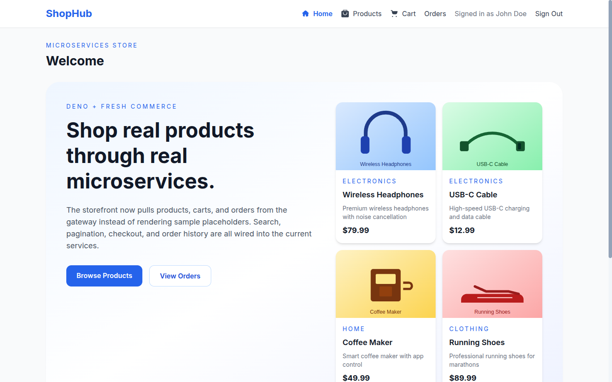
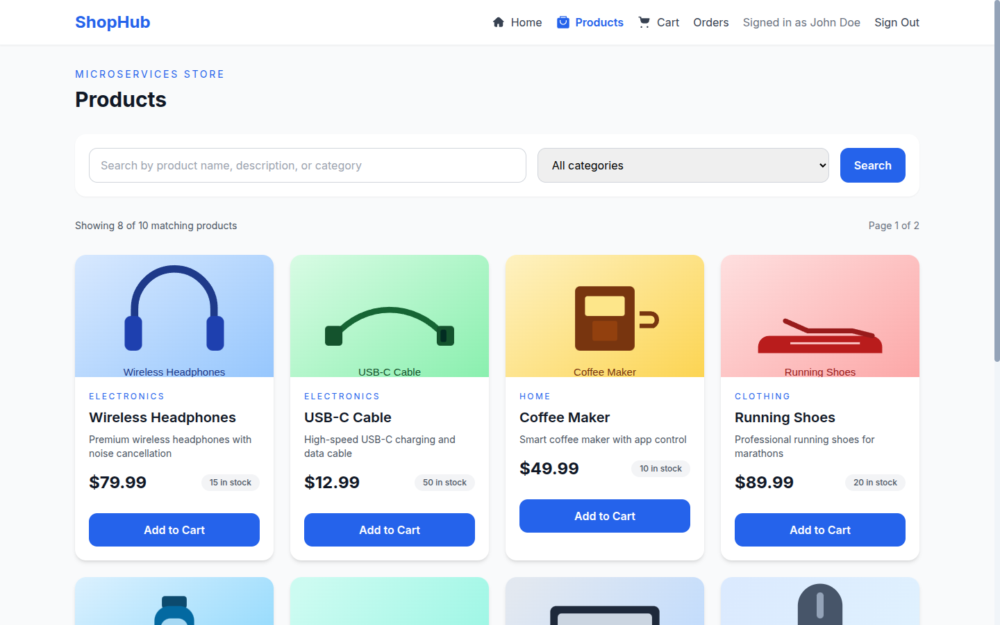
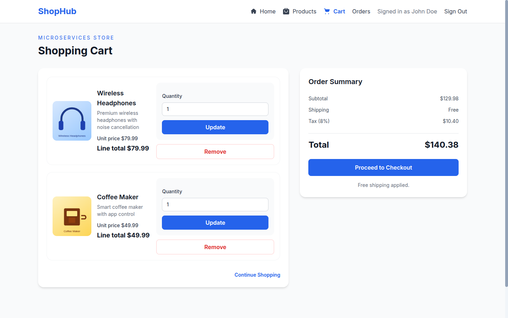
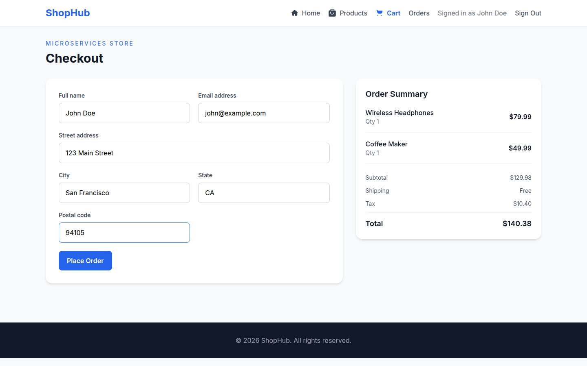
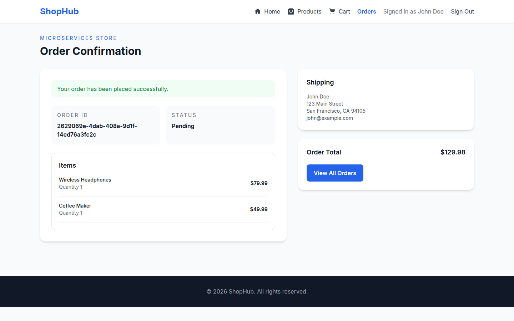

# ShopHub - Online Store Microservices

A production-ready microservices-based online store application built with **Deno**, **Fresh** framework, **PostgreSQL**, and **Redis**. Features a complete e-commerce workflow with shopping carts, order management, authentication, and product browsing.

## 🚀 Quick Start

### Prerequisites
- Docker & Docker Compose installed (or Deno 1.40+ for local development)
- 4GB RAM available for containerized services

### Start Application 

```bash
# Navigate to project directory
cd /path/to/microservices

# Start all services with one command
docker-compose up --build

# Services will be available at:
# Frontend: http://localhost:8000
# API Gateway: http://localhost:3000
```

That's it! The application initializes with sample data automatically.

## 📋 Features

### ✅ Complete & Tested
- **User Authentication** - JWT-based login with demo users (john@example.com, jane@example.com, bob@example.com)
- **Product Browsing** - Full-text search, category filtering, pagination
- **Shopping Cart** - Add/remove items, update quantities, view totals
- **Checkout Flow** - Address validation, tax calculation, order creation
- **Order History** - View past orders with details
- **Order Confirmation** - Instant confirmation with generated order ID and shipping address
- **End-to-End Testing** - Complete checkout workflow validated and working

### 🔧 Technical Features
- **API Rate Limiting** - 1000 requests/minute per client IP
- **Distributed Tracing** - X-Trace-Id header for request tracking
- **Health Checks** - Real-time service health monitoring
- **Error Handling** - Comprehensive error messages and HTTP status codes
- **Database Migrations** - Automatic schema setup on container start
- **Docker Caching** - Optimized builds with dependency layer reuse

### 🗺️ Architecture

```
┌─────────────────────────────────────────────────────────┐
│                      Frontend (8000)                    │
│         Fresh SSR + Preact + Tailwind CSS               │
│    ├─ Login & Authentication (JWT + HttpOnly Cookie)   │
│    ├─ Product Search/Browse/Filter                     │
│    ├─ Shopping Cart Management                         │
│    ├─ Checkout with Address Form                       │
│    └─ Order History & Confirmation Pages               │
└────────────────────────┬────────────────────────────────┘
                         │
          ┌──────────────┴──────────────┐
          │    API Gateway (3000)       │
          │  Route Aggregation & Rate   │
          │    Limiting + Tracing       │
          └──┬──────────┬──────┬────────┘
             │          │      │
    ┌────────┘          │      └────────┐
    │                   │               │
┌───▼────┐      ┌──────▼───┐    ┌─────▼──┐
│Products │      │  Orders  │    │ Carts  │
│Service  │      │ Service  │    │Service │
│ (3003)  │      │ (3004)   │    │(3005)  │
└───┬────┘      └──────┬───┘    └────┬──┘
    │                  │             │
    │      PostgreSQL  │              Redis
    └──────────────┬───┘              │
                   │                  │
            ┌──────┴──────────────────┘
            │
         (Shared Data Storage)
```

## � Screenshots

| Homepage | Products |
|----------|----------|
|  |  |

| Shopping Cart | Checkout |
|---------------|----------|
|  |  |

| Order Confirmation |
|--------------------|
|  |

## �📚 Service Documentation

| Service | Port | Purpose | Documentation |
|---------|------|---------|---------------|
| **API Gateway** | 3000 | Single entry point for all requests, aggregation, rate limiting | [API Gateway README](services/api-gateway/README.md) |
| **Products Service** | 3003 | Product catalog, search, filtering | [Products README](services/products-service/README.md) |
| **Orders Service** | 3004 | Order creation, status tracking, persistence | [Orders README](services/orders-service/README.md) |
| **Cart Service** | 3005 | Cart management with Redis backend | [Cart README](services/cart-service/README.md) |
| **Frontend** | 8000 | User interface with Fresh SSR | Built-in routing and components |

## 🔌 API Endpoints

All endpoints are accessed through the API Gateway at `http://localhost:3000` or `http://localhost:8000/api` from the frontend.

### Authentication
```
POST   /api/auth/login        - Login with credentials (returns JWT token)
POST   /api/auth/logout       - Logout and clear session
GET    /api/auth/me           - Get current user info
```

### Products
```
GET    /api/products                - List all products with pagination (limit, offset)
GET    /api/products?category=X     - Filter by category
GET    /api/products?search=term    - Search products by name
GET    /api/products/{id}           - Get single product details
POST   /api/products                - Create new product (admin)
PUT    /api/products/{id}           - Update product (admin)
DELETE /api/products/{id}           - Delete product (admin)
```

### Shopping Cart
```
GET    /api/carts/{userId}                   - Retrieve user's cart
POST   /api/carts/{userId}/items             - Add item to cart
PUT    /api/carts/{userId}/items/{productId} - Update item quantity
DELETE /api/carts/{userId}/items/{productId} - Remove item from cart
DELETE /api/carts/{userId}                   - Clear entire cart
```

### Orders
```
POST   /api/orders                  - Create new order from cart
GET    /api/orders                  - List orders (queryable by userId, status)
GET    /api/orders/{id}             - Get order details
PUT    /api/orders/{id}/status      - Update order status (admin)
```

### Gateway Utilities
```
GET    /api/carts-enriched/{userId} - Cart with product details (gateway aggregation)
GET    /health                      - Gateway health check
```

## 🗄️ Data Models

### Product
```typescript
interface Product {
  id: string;
  name: string;
  description: string;
  price: number;
  image: string;
  category: string;
  stock: number;
  createdAt: Date;
  updatedAt: Date;
}
```

### Cart & CartItem
```typescript
interface CartItem {
  productId: string;
  quantity: number;
  price: number;
}

interface Cart {
  id: string;
  userId: string;
  items: CartItem[];
  total: number;
  expiresAt: Date; // 7-day TTL
}
```

### Order & OrderStatus
```typescript
type OrderStatus = "pending" | "confirmed" | "shipped" | "delivered" | "cancelled";

interface Order {
  id: string;
  userId: string;
  items: OrderItem[];
  subtotal: number;
  shipping: number;    // $5 if subtotal < $50, else free
  tax: number;         // 8% of subtotal
  total: number;
  shippingAddress: {
    street: string;
    city: string;
    state: string;
    zipCode: string;
    country: string;
  };
  status: OrderStatus;
  createdAt: Date;
  updatedAt: Date;
}
```

## 📊 Sample Data

The database initializes with sample products across multiple categories:

**Sample Products:**
- Electronics: Wireless Headphones ($79.99), USB-C Cable ($12.99)
- Home: Coffee Maker ($49.99)
- Sports: Running Shoes ($89.99)
- Books: Technical guides and more
- And 15+ additional sample products

**Demo Users** (all use password: `password123`):
- john@example.com - Standard user
- jane@example.com - Standard user
- bob@example.com - Standard user

**Available Categories:**
- Electronics, Home & Kitchen, Sports & Outdoors, Books, Clothing, Toys, Health & Beauty

## 💾 Pricing & Expenses

### Checkout Calculation Example
```
Order for $30 worth of items:
- Subtotal:        $30.00
- Shipping:        $5.00  (< $50, so fixed rate)
- Tax (8%):        $2.40  (calculated on subtotal)
────────────────────────
- Total:           $37.40

Order for $80 worth of items:
- Subtotal:        $80.00
- Shipping:        $0.00  (>= $50, so free)
- Tax (8%):        $6.40  (calculated on subtotal)
────────────────────────
- Total:           $86.40
```

## 📖 Deployment & Setup Guides

- **[Quick Start Guide](docs/QUICKSTART.md)** - Get up and running in 5 minutes
- **[Deployment Guide](docs/DEPLOYMENT.md)** - Production deployment with Kubernetes
- **[Project Summary](docs/PROJECT_SUMMARY.md)** - Complete component inventory

## 🔍 Database Access

To inspect the database directly:

```bash
# Connect to PostgreSQL
docker exec -it microservices-postgres-1 psql -U postgres -d products

# Useful queries
\dt                           # List all tables
SELECT * FROM products;       # View products
SELECT * FROM orders;         # View orders
SELECT * FROM order_items;    # View order items
```

Redis inspection:

```bash
# Connect to Redis
docker exec -it microservices-redis-1 redis-cli

# Useful commands
KEYS *                        # List all keys
GET cart:user123              # View specific cart
EXPIRE cart:user123           # Check TTL
```

## 🧪 Testing the Application

### Manual End-to-End Test
```bash
# 1. Open http://localhost:8000 in browser
# 2. Click "Demo Login" and select a user
# 3. Browse products using search/filters
# 4. Add items to cart
# 5. Click Checkout
# 6. Fill shipping address and submit
# 7. Confirm order details on order confirmation page
# 8. Visit "Orders" to see order history
```

### Verify Services are Running
```bash
# All services should return healthy status
curl http://localhost:3000/health       # API Gateway
curl http://localhost:3003/health       # Products Service
curl http://localhost:3004/health       # Orders Service
curl http://localhost:3005/health       # Cart Service
```

## 🛠️ Development

### Local Development (without Docker)

```bash
# Install Deno (if not already installed)
# Then for each service:

# Terminal 1: Products Service
cd services/products-service
deno run --allow-net --allow-env main.ts

# Terminal 2: Orders Service  
cd services/orders-service
deno run --allow-net --allow-env main.ts

# Terminal 3: Cart Service
cd services/cart-service
deno run --allow-net --allow-env main.ts

# Terminal 4: API Gateway
cd services/api-gateway
deno run --allow-net --allow-env main.ts

# Terminal 5: Frontend
cd frontend
deno task start  # or: deno run -A dev.ts
```

### Environment Variables

```bash
# API Gateway
PORT=3000
PRODUCTS_SERVICE_URL=http://localhost:3003
ORDERS_SERVICE_URL=http://localhost:3004
CART_SERVICE_URL=http://localhost:3005

# Products Service
PORT=3003
DB_HOST=localhost
DB_PORT=5432
DB_USER=postgres
DB_PASSWORD=postgres
DB_NAME=products

# Orders Service
PORT=3004
DB_HOST=localhost
DB_PORT=5432
DB_USER=postgres
DB_PASSWORD=postgres
DB_NAME=products
REDIS_URL=redis://localhost:6379

# Cart Service
PORT=3005
REDIS_URL=redis://localhost:6379
```

## 🐛 Known Issues & Limitations

1. **Product Names in Orders** - Currently stored as "Unknown product" - will be improved with product data enrichment in orders service
2. **Authentication** - Demo users only, no user registration flow yet
3. **Inventory Management** - Stock quantities not decremented on purchase (planned for future release)

## 🚀 Future Enhancements

- Add user registration, password reset, and profile management flows
- Implement product reviews and ratings with average score aggregation
- Introduce wishlist support with add-to-cart shortcuts
- Improve order item enrichment to persist product names/images at order time
- Add inventory reservation and stock decrement on confirmed checkout
- Add structured logging across all services with a shared log schema
- Add Prometheus metrics and alerting for latency, error rates, and resource usage
- Add horizontal autoscaling policies for Kubernetes deployments
- Evaluate service discovery evolution: stay with Kubernetes-native discovery or add Consul when scale justifies it
- Evolve toward a headless API architecture so the same backend can power both Web and Mobile clients with shared business capabilities
- Introduce an API experience layer (BFF or API gateway composition) for channel-specific payloads and versioning across Web and Mobile apps
- Add GraphQL support alongside REST (initially as a hybrid model) to enable flexible client-driven queries and reduce over-fetching
- Expand automated test coverage with contract, integration, and end-to-end suites

## 📦 Technologies Used

### Core Framework & Runtime
- **Deno** 1.40+ - Modern JavaScript/TypeScript runtime
- **Fresh** - Deno's web framework with server-side rendering
- **Preact** - Lightweight React alternative for components

### Frontend
- **Tailwind CSS** - Utility-first CSS framework  
- **Hero Icons** - Beautiful SVG icons

### Backend
- **Oak** - Express-like HTTP framework for Deno
- **PostgreSQL** - Relational database for products and orders
- **Redis** - In-memory cache and pub/sub for carts
- **djwt** - JWT token generation and verification

### DevOps
- **Docker** - Containerization
- **Docker Compose** - Multi-service orchestration
- **Kubernetes** - Production-grade orchestration (optional)

## 📄 License

This project is open source and available under the MIT License.

## 🤝 Contributing

Contributions are welcome. Use this workflow for consistent, reviewable changes:

1. Fork the repository and create a branch from `main` using a descriptive name (example: `feat/order-retries`)
2. Keep changes focused and atomic; avoid unrelated refactors in the same pull request
3. Run and verify local checks before opening a PR:
  - Start services: `docker-compose up --build`
  - Verify health endpoints for gateway and core services
  - Validate key user flow: login -> add to cart -> checkout -> order confirmation
4. Add or update tests for behavioral changes (unit/integration/e2e where applicable)
5. Update documentation when APIs, architecture, or setup steps change
6. Open a pull request with:
  - Summary of what changed and why
  - Screenshots/GIFs for UI updates
  - Notes about backward compatibility or migration steps
7. Address review feedback with incremental commits until approval

## 📞 Support & Questions

For issues or questions:
- Check existing documentation in [DEPLOYMENT.md](docs/DEPLOYMENT.md) and [QUICKSTART.md](docs/QUICKSTART.md)
- Review individual service READMEs in `services/*/README.md`
- Check Docker Compose logs: `docker-compose logs -f [service-name]`

# Connect to products database
\c products

# View products
SELECT * FROM products;
```

## Kubernetes Deployment (Production)

### Prerequisites

- Kubernetes cluster (1.24+)
- kubectl configured
- Docker images pushed to registry

### Deploy to Kubernetes

1. **Build and push images:**

```bash
docker build -t your-registry/api-gateway:latest services/api-gateway/
docker build -t your-registry/products-service:latest services/products-service/
docker push your-registry/api-gateway:latest
docker push your-registry/products-service:latest
# ... repeat for other services
```

2. **Deploy infrastructure:**

```bash
kubectl apply -f kubernetes/01-infrastructure.yaml
```

3. **Deploy services:**

```bash
kubectl apply -f kubernetes/02-services.yaml
```

4. **Enable autoscaling:**

```bash
kubectl apply -f kubernetes/03-autoscaling.yaml
```

5. **Monitor deployment:**

```bash
# Check pods
kubectl get pods -n microservices

# Watch logs
kubectl logs -n microservices -f deployment/api-gateway

# Get service endpoints
kubectl get svc -n microservices
```

### Access Services in Kubernetes

```bash
# Port forward to API Gateway
kubectl port-forward -n microservices svc/api-gateway 3000:80

# Access: http://localhost:3000
```

## Project Structure

```
microservices/
├── shared/
│   ├── types/
│   │   └── mod.ts              # Shared type definitions
│   ├── utils/
│   │   └── http-client.ts      # Service-to-service HTTP client
│   └── base-service.ts         # Base service class with common features
├── services/
│   ├── api-gateway/
│   │   ├── main.ts             # API Gateway entry point
│   │   └── Dockerfile
│   ├── products-service/
│   │   ├── main.ts             # Products Service
│   │   └── Dockerfile
│   ├── orders-service/
│   │   ├── main.ts             # Orders Service
│   │   └── Dockerfile
│   └── cart-service/
│       ├── main.ts             # Cart Service
│       └── Dockerfile
├── frontend/
│   ├── routes/
│   │   ├── index.tsx           # Home page
│   │   ├── products.tsx        # Products page
│   │   └── cart.tsx            # Shopping cart
│   ├── components/             # Reusable components
│   ├── deno.json               # Fresh project config
│   └── Dockerfile
├── database/
│   └── init.sql                # Database initialization
├── kubernetes/
│   ├── 01-infrastructure.yaml  # PostgreSQL, Redis
│   ├── 02-services.yaml        # Microservices deployments
│   └── 03-autoscaling.yaml     # HPA & PDB configurations
└── docker-compose.yml          # Local development setup
```

## Features

### ✅ Implemented

- [x] Microservices architecture with Deno
- [x] API Gateway with rate limiting and tracing
- [x] Service-to-service communication with retry logic
- [x] PostgreSQL database per service
- [x] Redis for caching and message passing
- [x] Health checks and service discovery
- [x] Fresh SSR frontend with Tailwind CSS
- [x] Docker & Docker Compose setup
- [x] Kubernetes YAML for production
- [x] HPA autoscaling configuration
- [x] Pod Disruption Budgets
- [x] Sample data and products

### 🎯 Frontend Features

- Modern responsive design with Tailwind CSS
- Hero sections and category browsing
- Product listing and shopping cart
- Order status tracking
- Clean UI with emoji product placeholders

## Environment Variables

### Local (docker-compose)
```env
PORT=3000
DB_HOST=postgres
DB_PORT=5432
DB_USER=postgres
DB_PASSWORD=postgres
REDIS_HOST=redis
REDIS_PORT=6379
```

### Production (Kubernetes)
Located in `kubernetes/01-infrastructure.yaml`

## Health Checks

All services expose health endpoints:

```
GET /health           - Full health status
GET /health/live      - Liveness probe
GET /health/ready     - Readiness probe
```

Example response:
```json
{
  "status": "healthy",
  "service": "products-service",
  "version": "1.0.0",
  "uptime": 1234,
  "checks": {
    "database": {
      "status": "healthy",
      "latency": 12
    }
  }
}
```

## Development

### Run Services Locally

1. **Products Service:**
```bash
deno run --allow-net --allow-env services/products-service/main.ts
```

2. **Orders Service:**
```bash
deno run --allow-net --allow-env services/orders-service/main.ts
```

3. **Cart Service:**
```bash
deno run --allow-net --allow-env services/cart-service/main.ts
```

4. **API Gateway:**
```bash
deno run --allow-net --allow-env services/api-gateway/main.ts
```

5. **Frontend:**
```bash
cd frontend
deno run -A --watch=static/,routes/ dev.ts
```

### Database Initialization

Run migrations manually:
```bash
psql -U postgres -f database/init.sql
```

## Performance Considerations

- **Rate Limiting**: 1000 requests/minute per IP
- **Connection Pooling**: Optimized for database connections
- **Caching**: Redis for cart data with 7-day TTL
- **HPA**: Scales from 2-10 replicas based on CPU/Memory
- **Graceful Shutdown**: 5-second window for in-flight requests

## Security

- ✅ Permission-based execution (Deno's security model)
- ✅ Environment variable isolation
- ✅ Network policies in Kubernetes
- ✅ Service-to-service tracing
- ✅ Health checks for malfunction detection

## Scaling Strategy

### Horizontal Scaling
- API Gateway: 3-10 replicas (high traffic)
- Products Service: 2-8 replicas
- Orders Service: 2-8 replicas
- Cart Service: 2-8 replicas

### Vertical Scaling
- Increase resource requests/limits in Kubernetes
- Adjust database connection pool size

## Monitoring & Observability

Structured JSON logging from all services includes:
- Timestamp
- Service name
- Trace ID (for correlation)
- HTTP method & path
- Response status
- Duration

## Troubleshooting

### Services won't connect
```bash
# Check if containers are running
docker ps

# Check logs
docker logs microservices-api-gateway-1
```

### Database connection errors
```bash
# Check PostgreSQL
docker logs microservices-postgres-1

# Verify connection
docker exec microservices-postgres-1 psql -U postgres -c "SELECT 1"
```

### High memory usage
```bash
# Check which service
docker stats

# Increase container limits in docker-compose.yml
```

## Technology Stack

| Component | Technology |
|-----------|-----------|
| Runtime | Deno 1.40+  |
| Web Server | Oak v12  |
| Frontend | Fresh + Preact |
| Styling | Tailwind CSS |
| Database | PostgreSQL 15 |
| Caching | Redis 7 |
| Containerization | Docker |
| Orchestration | Kubernetes |
| Icons | Hero Icons |

## License

MIT - Open source and free to use

## Community

Feel free to submit issues, enhancement requests, and pull requests.

## Support

- Deno documentation: https://docs.deno.com
- Oak documentation: https://oak.deno.dev
- Fresh documentation: https://fresh.deno.dev
- Kubernetes documentation: https://kubernetes.io/docs

## Author

Built with ❤️ for the microservices community
