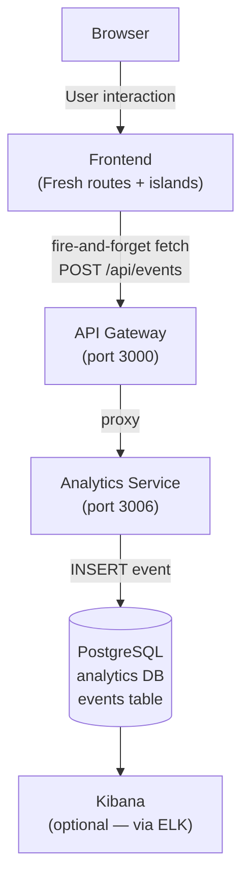
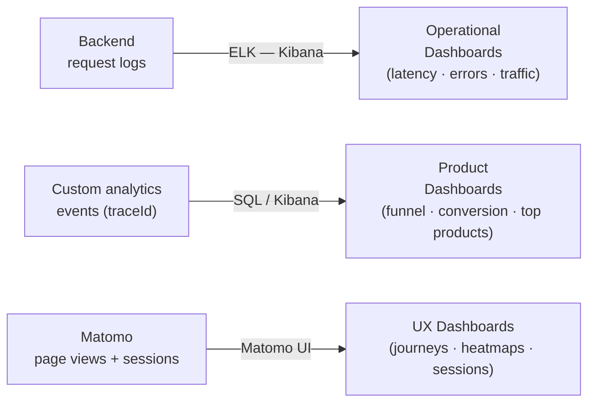

# ShopHub — Click Analytics

## 1. Overview

Click analytics captures **user behaviour events** (page views, product interactions, cart actions, checkout funnel steps) to answer product questions that backend request logs cannot: which products are browsed but never purchased? Where do users abandon the checkout funnel? What is the conversion rate from product view to order placed?

This document covers two complementary approaches and how they fit the existing Docker-based stack.

---

## 2. What to Track

### 2.1 Event Taxonomy

| Event | Trigger | Key Properties |
|-------|---------|---------------|
| `page_viewed` | Any route load | `page`, `userId`, `sessionId` |
| `product_viewed` | `/products/:id` or product card click | `productId`, `productName`, `category`, `price` |
| `product_searched` | Search input on `/products` | `query`, `resultCount` |
| `add_to_cart` | "Add to cart" button click | `productId`, `quantity`, `price` |
| `cart_viewed` | Navigate to `/cart` | `itemCount`, `cartTotal` |
| `checkout_started` | Navigate to `/checkout` | `itemCount`, `cartTotal` |
| `checkout_submitted` | Form POST on `/checkout` | `itemCount`, `orderTotal` |
| `order_placed` | Successful order creation | `orderId`, `orderTotal`, `itemCount` |
| `payment_succeeded` | Successful charge | `orderId`, `amount`, `provider` |
| `payment_declined` | Failed charge | `orderId`, `errorCode`, `provider` |
| `order_viewed` | `/order-confirmation/:id` | `orderId`, `status` |

### 2.2 Checkout Funnel

```mermaid
funnel
    title Checkout Funnel
    section Top of Funnel
        Product viewed : 1000
    section Mid Funnel
        Add to cart : 320
        Cart viewed : 250
    section Bottom Funnel
        Checkout started : 180
        Checkout submitted : 120
        Order placed : 110
        Payment succeeded : 105
```

---

## 3. Approach A — Custom Analytics Service (Recommended)

Build a new `analytics-service` microservice (Deno / Oak / BaseService — same pattern as all other services). Events are fired from the frontend as fire-and-forget `fetch` calls and stored in PostgreSQL. The `traceId` links click events directly to backend request logs in ELK.

### 3.1 Architecture



### 3.2 Analytics Service

**Port:** 3006  
**Database:** PostgreSQL `analytics` DB

#### Event Schema

```sql
CREATE TABLE events (
  id          UUID PRIMARY KEY,
  event       VARCHAR(100) NOT NULL,
  session_id  VARCHAR(255),
  user_id     VARCHAR(255),
  trace_id    VARCHAR(255),
  properties  JSONB,
  page        TEXT,
  user_agent  TEXT,
  created_at  TIMESTAMP NOT NULL
);

CREATE INDEX ON events (event, created_at DESC);
CREATE INDEX ON events (user_id, created_at DESC);
CREATE INDEX ON events (session_id, created_at DESC);
CREATE INDEX ON events USING GIN (properties);
```

#### API Surface

| Method | Path | Description |
|--------|------|-------------|
| `POST` | `/api/events` | Ingest a single event |
| `POST` | `/api/events/batch` | Ingest up to 50 events in one call |
| `GET`  | `/api/events/funnel` | Funnel query: conversion between two events (`?from=&to=&since=`) |
| `GET`  | `/api/events/count` | Count events by type over time (`?event=&period=day`) |
| `GET`  | `/health`, `/health/live`, `/health/ready` | Standard health endpoints |

#### Event Payload

```json
{
  "event": "add_to_cart",
  "sessionId": "sess_a1b2c3",
  "userId": "550e8400-...",
  "traceId": "a3f1c2d4-...",
  "page": "/products",
  "properties": {
    "productId": "650e8400-...",
    "productName": "Wireless Headphones",
    "quantity": 1,
    "price": 79.99
  }
}
```

### 3.3 Frontend Integration

Add a single `trackEvent()` helper to `frontend/utils/analytics.ts`:

```typescript
// frontend/utils/analytics.ts

let sessionId: string | null = null;

function getSessionId(): string {
  if (!sessionId) {
    // persist in sessionStorage so it survives route navigations
    sessionId = globalThis.sessionStorage?.getItem("shophub_sid")
      ?? crypto.randomUUID();
    globalThis.sessionStorage?.setItem("shophub_sid", sessionId);
  }
  return sessionId;
}

export function trackEvent(
  event: string,
  properties: Record<string, unknown> = {},
  userId?: string,
): void {
  // Fire-and-forget — never await, never block the user
  fetch("/api/events", {
    method: "POST",
    headers: { "Content-Type": "application/json" },
    body: JSON.stringify({
      event,
      sessionId: getSessionId(),
      userId,
      page: globalThis.location?.pathname,
      properties,
      timestamp: new Date().toISOString(),
    }),
  }).catch(() => {}); // silent fail — analytics must never break the UI
}
```

**Example calls in existing routes:**

```typescript
// frontend/routes/checkout.tsx — in POST handler after successful payment
trackEvent("payment_succeeded", { orderId, amount: summary.total, provider: "mock" }, user.id);

// frontend/islands/AsyncAddToCartButton.tsx — after add succeeds
trackEvent("add_to_cart", { productId, quantity, price }, userId);

// frontend/routes/products.tsx — in GET handler (server side)
// (use fetch directly here since trackEvent uses browser APIs)
```

**Server-side tracking** (Fresh GET handlers) can call the analytics API directly via `shopApi`:

```typescript
// Inside a route GET handler
await shopApi("/api/events", {
  method: "POST",
  body: JSON.stringify({ event: "product_viewed", userId: user?.id, properties: { productId } }),
}).catch(() => {});
```

### 3.4 Docker Compose Addition

```yaml
analytics-service:
  build:
    context: .
    dockerfile: ./services/analytics-service/Dockerfile
  ports:
    - "3006:3006"
  environment:
    PORT: "3006"
    DB_HOST: postgres
    DB_PORT: "5432"
    DB_USER: postgres
    DB_PASSWORD: postgres
    DB_NAME: analytics
  depends_on:
    postgres:
      condition: service_healthy
  networks:
    - microservices

# api-gateway gets: ANALYTICS_SERVICE_URL: http://analytics-service:3006
```

### 3.5 What You Can Query Immediately

```sql
-- Daily active users
SELECT DATE(created_at) as day, COUNT(DISTINCT user_id) as dau
FROM events
WHERE created_at > NOW() - INTERVAL '30 days'
GROUP BY 1 ORDER BY 1;

-- Checkout funnel conversion (last 7 days)
SELECT
  COUNT(*) FILTER (WHERE event = 'checkout_started')    AS started,
  COUNT(*) FILTER (WHERE event = 'checkout_submitted')  AS submitted,
  COUNT(*) FILTER (WHERE event = 'payment_succeeded')   AS paid
FROM events
WHERE created_at > NOW() - INTERVAL '7 days';

-- Top products by add-to-cart events
SELECT properties->>'productName' as product, COUNT(*) as adds
FROM events
WHERE event = 'add_to_cart'
GROUP BY 1 ORDER BY 2 DESC LIMIT 10;

-- Payment decline rate
SELECT
  COUNT(*) FILTER (WHERE event = 'payment_succeeded') as successes,
  COUNT(*) FILTER (WHERE event = 'payment_declined')  as declines,
  ROUND(
    COUNT(*) FILTER (WHERE event = 'payment_declined')::numeric /
    NULLIF(COUNT(*) FILTER (WHERE event IN ('payment_succeeded','payment_declined')), 0) * 100, 1
  ) AS decline_pct
FROM events
WHERE created_at > NOW() - INTERVAL '7 days';
```

---

## 4. Approach B — Matomo (Self-Hosted Product Analytics)

Matomo is an open-source Google Analytics alternative that ships as a Docker image. It provides dashboards, funnel analysis, session recordings, and heatmaps with no custom backend code required.

### 4.1 Docker Compose Addition

```yaml
matomo:
  image: matomo:5-apache
  ports:
    - "8080:80"
  environment:
    MATOMO_DATABASE_HOST: postgres
    MATOMO_DATABASE_DBNAME: matomo
    MATOMO_DATABASE_USERNAME: postgres
    MATOMO_DATABASE_PASSWORD: postgres
  volumes:
    - matomo_data:/var/www/html
  depends_on:
    postgres:
      condition: service_healthy
  networks:
    - microservices

# Add to volumes: matomo_data:
```

### 4.2 Frontend Integration

Add Matomo's tracking snippet to `frontend/components/layout.tsx` inside the `<head>`:

```html
<script>
  var _paq = window._paq = window._paq || [];
  _paq.push(['trackPageView']);
  _paq.push(['enableLinkTracking']);
  (function() {
    var u = "http://localhost:8080/";
    _paq.push(['setTrackerUrl', u + 'matomo.php']);
    _paq.push(['setSiteId', '1']);
    var d = document, g = d.createElement('script'), s = d.getElementsByTagName('script')[0];
    g.async = true; g.src = u + 'matomo.js'; s.parentNode.insertBefore(g, s);
  })();
</script>
```

Custom events (e.g. "Add to Cart") can be sent via:

```javascript
_paq.push(['trackEvent', 'Cart', 'Add to Cart', productName, price]);
```

### 4.3 Matomo vs Custom Service Trade-offs

| | Custom Analytics Service | Matomo |
|--|--------------------------|--------|
| Setup effort | Medium — build a service | Low — drop in Docker image |
| `traceId` correlation | Yes — events carry the same traceId as backend logs | No — isolated from backend logs |
| SQL query flexibility | Full — raw PostgreSQL queries | Limited to Matomo's report API |
| Custom event schema | Full control | Fixed schema, custom dimensions |
| Dashboards | Build in Kibana (if ELK) or Metabase/Grafana | Built-in Matomo UI out of the box |
| Funnel analysis | Write SQL | Built-in funnel plugin |
| Session recording / heatmaps | No | Yes (Matomo plugin) |
| Data ownership | Fully in your PostgreSQL | Matomo's own MySQL/PostgreSQL schema |

---

## 5. Recommended Combination



- **ELK** for operational observability (backend request logs, error rates, latency)
- **Custom analytics service** for business KPIs correlated with `traceId` (funnel, conversion, revenue)
- **Matomo** (optional) for UX-level insights (session recordings, heatmaps) — add later when the product needs it

---

## 6. Implementation Checklist

### Phase 1 — Custom Analytics Service ✅ Implemented
- [x] Create `services/analytics-service/main.ts` (BaseService pattern, PostgreSQL, port 3006)
- [x] Create `services/analytics-service/Dockerfile`
- [x] Add `analytics` DB + `events` table to `database/init.sql`
- [x] Add `analytics-service` to `docker-compose.yml`
- [x] Add proxy routes `/api/events` + `/api/events/:path*` to `services/api-gateway/main.ts`
- [x] Create `frontend/utils/analytics.ts` with `trackEvent()` (works server-side and client-side)
- [x] Wire `add_to_cart` event in `frontend/islands/AsyncAddToCartButton.tsx`
- [x] Wire `payment_succeeded` and `payment_declined` events in `frontend/routes/checkout.tsx`

### Phase 2 — ELK Integration ✅ Implemented
- [x] Create `docker-compose.elk.yml` with Elasticsearch 8.11, Kibana, Logstash, Filebeat
- [x] Create `observability/filebeat.yml` (container log input + Docker metadata)
- [x] Create `observability/logstash.conf` (JSON parse, field promotion, numeric type coercion)
- [x] Add `level` field to `BaseService.loggingMiddleware()` in `shared/base-service.ts`
- [x] Change `duration` string → `durationMs` integer for numeric aggregations in ELK
- [x] Normalise frontend error logs to JSON (`shop.ts`, `checkout.tsx`)
- [x] Add domain event logs: `order_created`, `payment_charged`, `payment_declined`
- [ ] Build Kibana index pattern (`shophub-*`) and core dashboards (manual step after first run)

### Phase 3 — Matomo (optional, ~2 hours)
- [ ] Add `matomo` service to `docker-compose.yml`
- [ ] Add tracking snippet to `frontend/components/layout.tsx`
- [ ] Configure site ID and custom event dimensions in Matomo UI
