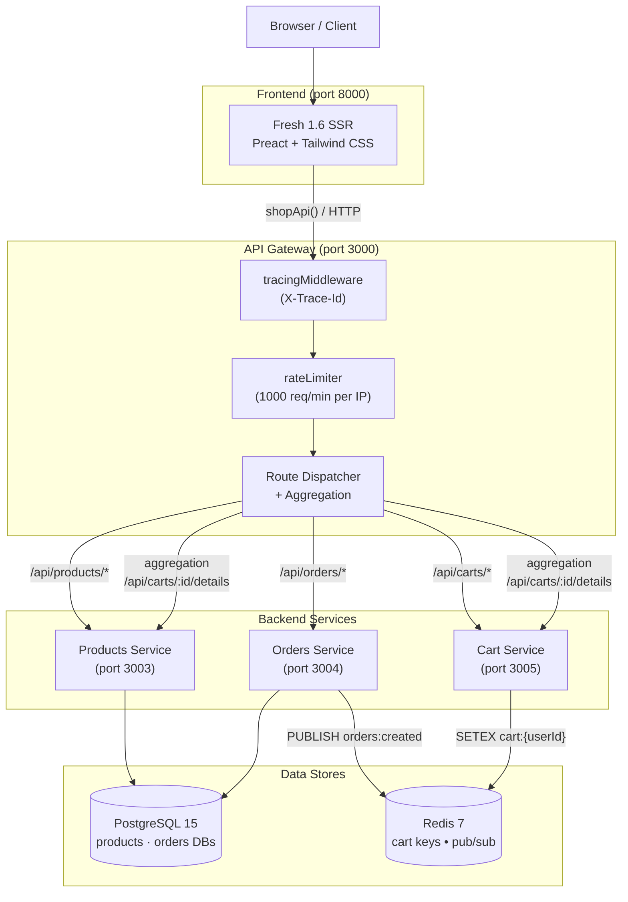
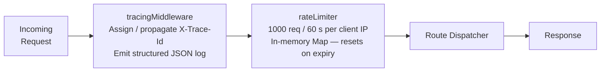
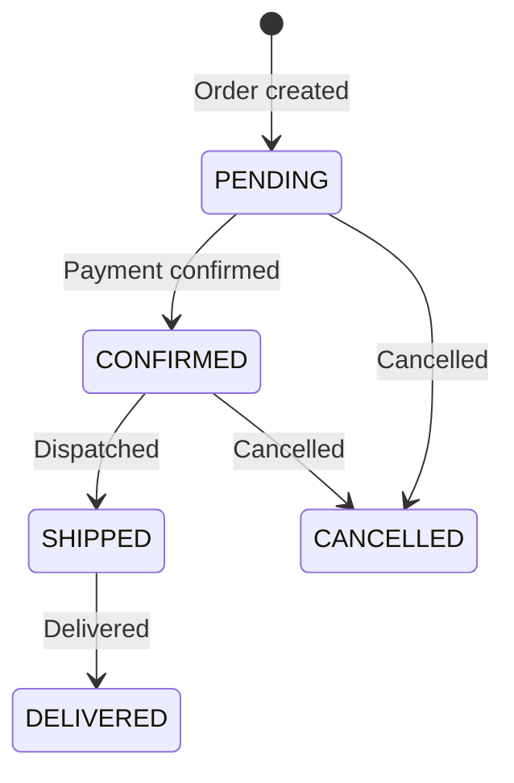
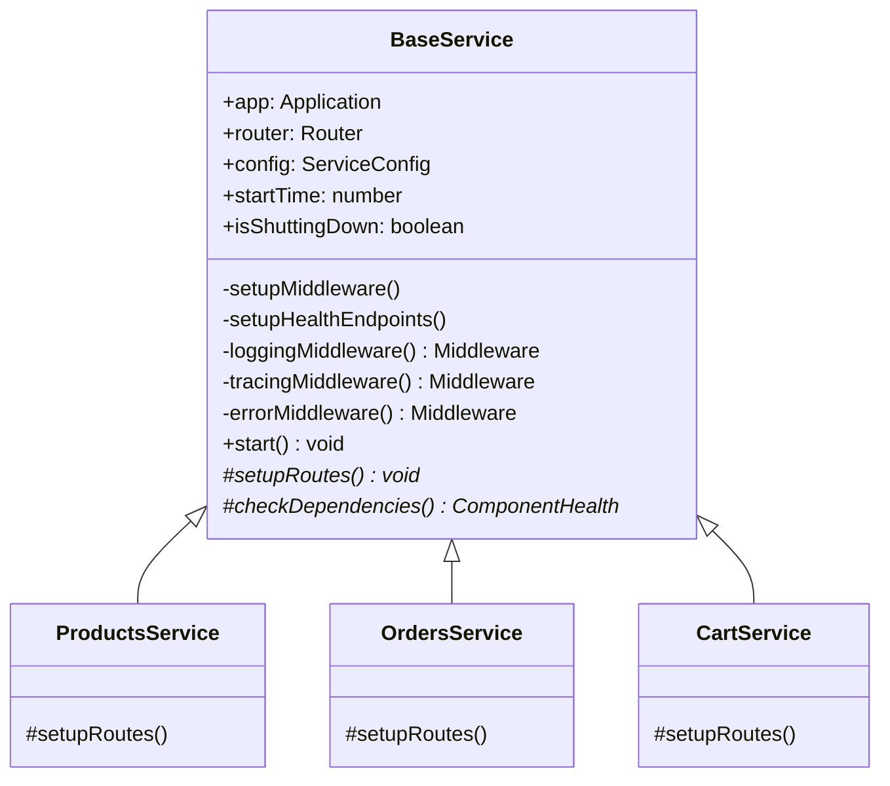
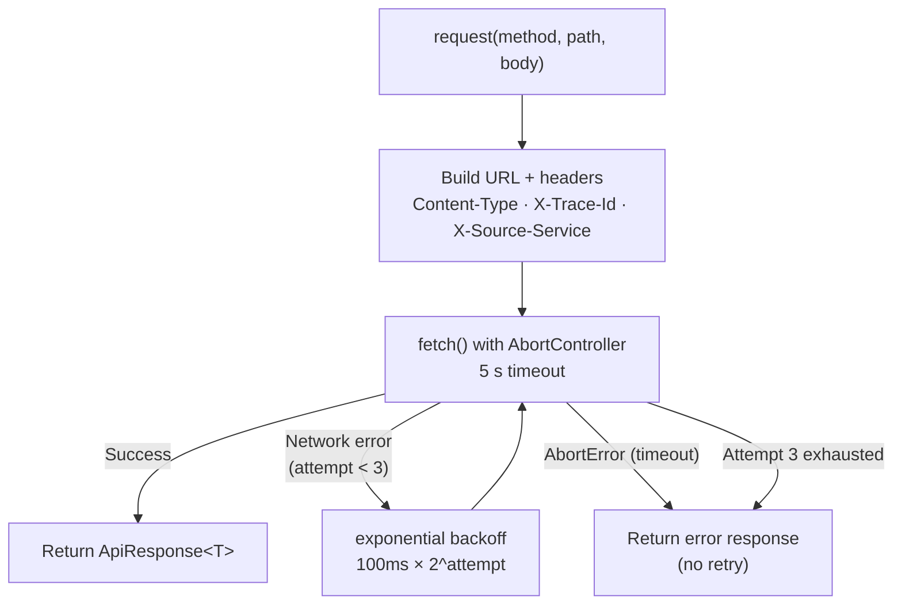
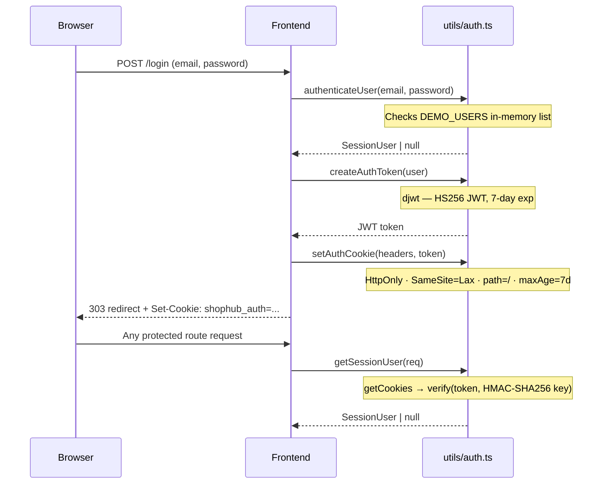
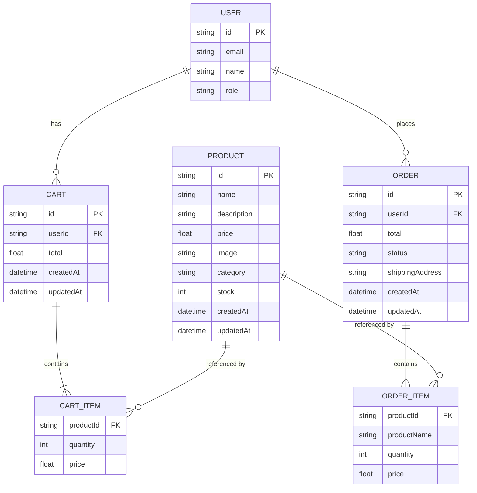
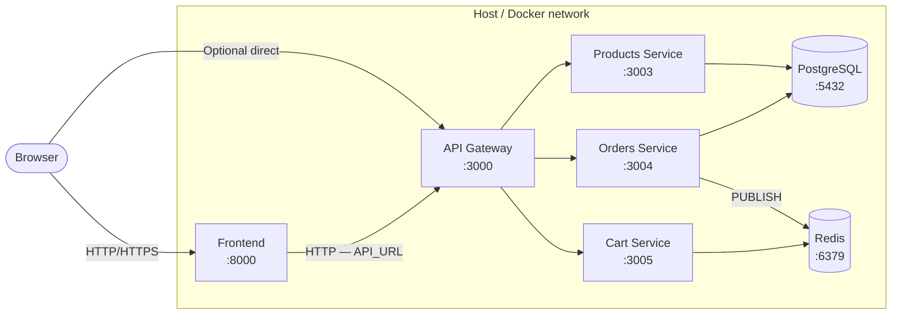
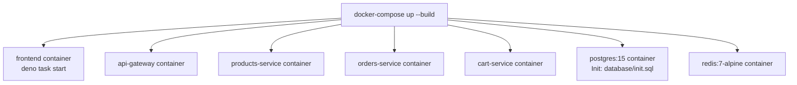

# ShopHub — Architecture Document

## 1. System Overview

ShopHub is a microservices-based e-commerce platform built on Deno. A **Fresh SSR frontend** communicates exclusively through an **API Gateway**, which routes and aggregates requests to three backend services. Persistence is split by domain: PostgreSQL for relational data (products, orders) and Redis for ephemeral cart state.



---

## 2. Services

### 2.1 Frontend (`frontend/`)

| Attribute | Value |
|-----------|-------|
| Framework | Fresh 1.6.0 (Deno SSR) |
| UI | Preact 10.19.5, Tailwind CSS 3.3.6 |
| Port | 8000 |
| Auth | JWT in HttpOnly cookie (`shophub_auth`), verified server-side on every request |
| API calls | `shopApi()` in `utils/shop.ts` — wraps `fetch()`, targets `API_URL` env var (default `http://localhost:3000`) |

**File-based routes:**

| Route | Handler | Purpose |
|-------|---------|---------|
| `/` | `routes/index.tsx` | Homepage — 4 featured products + category links |
| `/login` | `routes/login.tsx` | Auth form |
| `/logout` | `routes/logout.ts` | Clears cookie |
| `/products` | `routes/products.tsx` | Full catalogue: search, category filter, pagination (8/page) |
| `/cart` | `routes/cart.tsx` | Cart view with enriched product details |
| `/checkout` | `routes/checkout.tsx` | Address form, order submission |
| `/orders` | `routes/orders.tsx` | Order history |
| `/order-confirmation/[id]` | `routes/order-confirmation/[id].tsx` | Per-order detail page |
| `/api/carts/[userId]/items` | `routes/api/carts/[userId]/items.ts` | Island-driven async add-to-cart |

### 2.2 API Gateway (`services/api-gateway/`)

| Attribute | Value |
|-----------|-------|
| Runtime | Deno + Oak v12.6.1 |
| Port | 3000 |

**Middleware stack (applied in order):**



**Routes:**

| Method | Path | Behaviour |
|--------|------|-----------|
| `GET` | `/health` | Gateway health JSON |
| `ALL` | `/api/products/:path*` | Proxy → products-service:3003 |
| `GET` | `/api/carts/:userId/details` | **Aggregation**: parallel fetch from cart-service + products-service, merges product details into cart items |
| `ALL` | `/api/carts/:path*` | Proxy → cart-service:3005 |
| `ALL` | `/api/orders/:path*` | Proxy → orders-service:3004 |

### 2.3 Products Service (`services/products-service/`)

| Attribute | Value |
|-----------|-------|
| Runtime | Deno + Oak v12.6.1 |
| Port | 3003 |
| Database | PostgreSQL 15 — `products` database |

**API surface:**

| Method | Path | Description |
|--------|------|-------------|
| `POST` | `/api/products` | Create product |
| `GET` | `/api/products` | List with `limit`, `offset`, `category` query params |
| `GET` | `/api/products/:id` | Single product |
| `PUT` | `/api/products/:id` | Update product |
| `DELETE` | `/api/products/:id` | Delete product |

### 2.4 Orders Service (`services/orders-service/`)

| Attribute | Value |
|-----------|-------|
| Runtime | Deno + Oak v12.6.1 |
| Port | 3004 |
| Database | PostgreSQL 15 — `orders` database |
| Events | Redis `PUBLISH orders:created` on every successful order |

**API surface:**

| Method | Path | Description |
|--------|------|-------------|
| `POST` | `/api/orders` | Create order — inserts to DB + publishes event |
| `GET` | `/api/orders` | List orders (`userId`, `status`, `limit`, `offset`) |
| `GET` | `/api/orders/:id` | Get order |
| `PUT` | `/api/orders/:id/status` | Update order status |

**Order status lifecycle:**



### 2.5 Cart Service (`services/cart-service/`)

| Attribute | Value |
|-----------|-------|
| Runtime | Deno + Oak v12.6.1 |
| Port | 3005 |
| Storage | Redis 7 — JSON payloads at key `cart:{userId}`, 7-day sliding TTL (`SETEX 604800`) |

**API surface:**

| Method | Path | Description |
|--------|------|-------------|
| `GET` | `/api/carts/:userId` | Get (or create empty) cart |
| `POST` | `/api/carts/:userId/items` | Add item — merges quantity if product already in cart |
| `PUT` | `/api/carts/:userId/items/:productId` | Update quantity |
| `DELETE` | `/api/carts/:userId/items/:productId` | Remove item |
| `DELETE` | `/api/carts/:userId` | Clear entire cart |

---

## 3. Shared Platform Layer

All backend services extend `BaseService` from `shared/base-service.ts`:



**Capabilities provided by `BaseService`:**

| Capability | Detail |
|-----------|--------|
| Logging | JSON structured log per request: `timestamp`, `service`, `traceId`, `method`, `url`, `status`, `duration` |
| Tracing | Reads `X-Trace-Id` from request; propagates to response headers and `ctx.state.traceId` |
| Error handling | Catches unhandled exceptions, returns `ApiResponse` with `success: false` |
| Health endpoints | `GET /health/live` (liveness), `GET /health/ready` (readiness + dependency checks) |
| Graceful shutdown | Handles `SIGTERM`/`SIGINT`, drains in-flight requests |

### ServiceClient (`shared/utils/http-client.ts`)

Inter-service HTTP with resilience built-in:



| Property | Value |
|----------|-------|
| Max retries | 3 attempts |
| Backoff | 100 ms × 2^attempt (100 ms, 200 ms, 400 ms) |
| Timeout | 5 000 ms per attempt (AbortController) |
| Propagated headers | `X-Trace-Id`, `X-Source-Service` |
| Response shape | `ApiResponse<T> { success, data?, error?, timestamp, traceId? }` |

---

## 4. Authentication

Authentication is handled entirely in the frontend. No backend service performs auth checks (the gateway is the trust boundary in development).



---

## 5. Data Model



**Storage mapping:**

| Entity | Store | Details |
|--------|-------|---------|
| Products | PostgreSQL 15 (`products` DB) | Persistent, seeded by `database/init.sql` |
| Orders | PostgreSQL 15 (`orders` DB) | Persistent, with `items` column stored as JSON |
| Cart | Redis 7 | JSON at `cart:{userId}`, 7-day sliding TTL |
| User session | Frontend cookie | HS256 JWT — no server-side session store |

---

## 6. Network Topology



**Environment variables driving service discovery:**

| Variable | Default | Used by |
|----------|---------|---------|
| `API_URL` | `http://localhost:3000` | Frontend `shopApi()` |
| `PRODUCTS_SERVICE_URL` | `http://products-service:3003` | API Gateway |
| `ORDERS_SERVICE_URL` | `http://orders-service:3004` | API Gateway |
| `CART_SERVICE_URL` | `http://cart-service:3005` | API Gateway |
| `DATABASE_URL` | postgres connection string | Products, Orders services |
| `REDIS_URL` | `redis://redis:6379` | Orders, Cart services |
| `JWT_SECRET` | `shophub-dev-secret` | Frontend auth utils |

---

## 7. Observability

### Distributed Tracing

Every request is assigned a `X-Trace-Id` UUID at the gateway edge. The ID propagates through the full call chain:

```
Browser → Gateway (assigns X-Trace-Id) → Backend Service (reads ctx.state.traceId) → Response (echoes X-Trace-Id header)
```

`ServiceClient` automatically carries `X-Trace-Id` and `X-Source-Service` headers on all inter-service calls.

### Structured Logging

Every service emits one JSON log line per request:

```json
{
  "timestamp": "2026-03-24T10:00:00.000Z",
  "service": "orders-service",
  "traceId": "550e8400-e29b-41d4-a716-446655440000",
  "method": "POST",
  "url": "/api/orders",
  "status": 201,
  "duration": "42ms"
}
```

### Health Checks

All services expose two endpoints via `BaseService`:

| Endpoint | Purpose | Checks |
|----------|---------|--------|
| `GET /health/live` | Kubernetes liveness probe | Service is up |
| `GET /health/ready` | Kubernetes readiness probe | Service + all dependencies (DB, Redis) |

---

## 8. Deployment Model

### Local Development (Docker Compose)



### Kubernetes (Kustomize)

```
kubernetes/
├── base/
│   ├── infrastructure/    # Namespace, ConfigMap, Secrets, PostgreSQL StatefulSet, Redis StatefulSet, NetworkPolicy
│   └── services/          # Per-service: Deployment, Service, HPA, PodDisruptionBudget
└── overlays/
    ├── dev/               # 1 replica, latest image tags
    ├── staging/           # tagged images, staging tuning
    └── production/        # tagged images, production replicas, approval gates
```

Deploy a single service independently:

```bash
# Deploy only the orders-service to dev
kustomize build kubernetes/overlays/dev/services/orders-service | kubectl apply -f -

# Roll back
kubectl rollout undo deployment/orders-service -n shophub-dev
```

See [Kubernetes Target Structure](KUBERNETES_TARGET_STRUCTURE.md) and [kubernetes/base/README.md](../kubernetes/base/README.md) for the full reference.

---

## 9. Technology Stack Summary

| Layer | Technology | Version |
|-------|-----------|---------|
| Backend runtime | Deno | 1.40+ |
| HTTP framework | Oak | 12.6.1 |
| Frontend framework | Fresh | 1.6.0 |
| UI components | Preact | 10.19.5 |
| CSS | Tailwind CSS | 3.3.6 |
| JWTs | djwt | 3.0.2 |
| PostgreSQL client | deno-postgres | 0.17.0 |
| Redis client | deno-redis | 0.32.3 |
| Relational DB | PostgreSQL | 15 |
| Cache / pub-sub | Redis | 7 |
| Container runtime | Docker / Compose | — |
| K8s packaging | Kustomize | — |
