# ShopHub — User Flow and Request Flow Document

This document traces every major user journey end-to-end, from browser interaction through the service mesh to the data stores and back.

---

## 1. Authentication Flows

### 1.1 Login

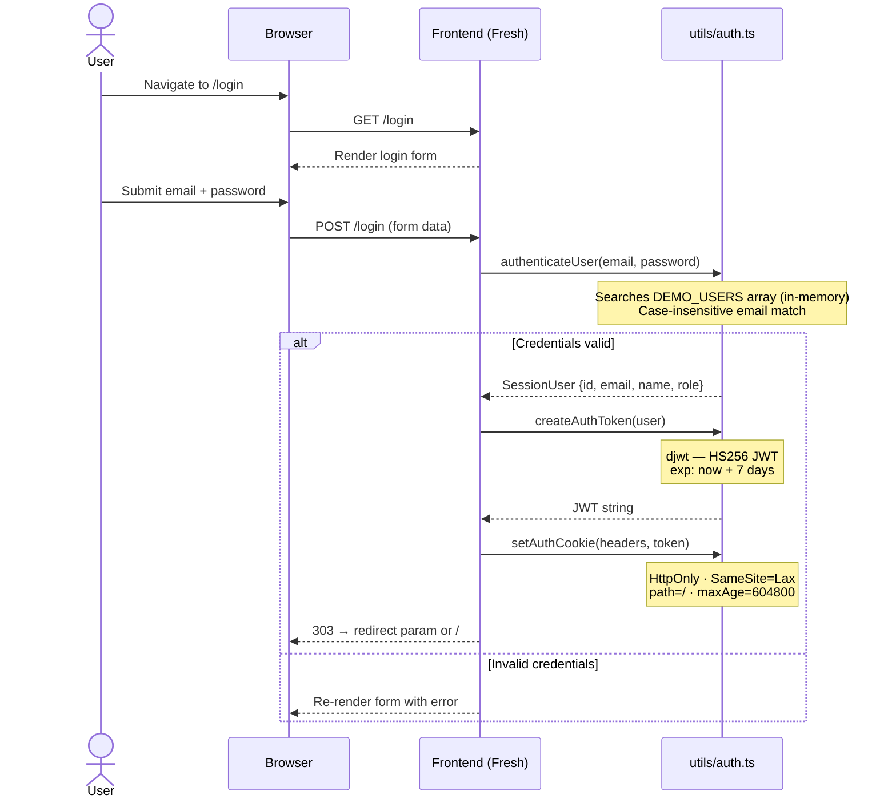

### 1.2 Session Verification (every protected route)

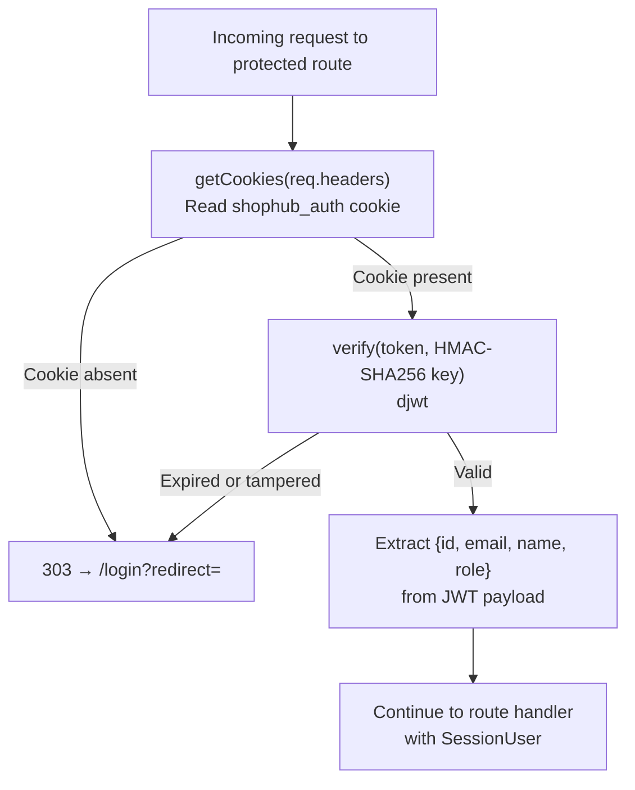

### 1.3 Logout

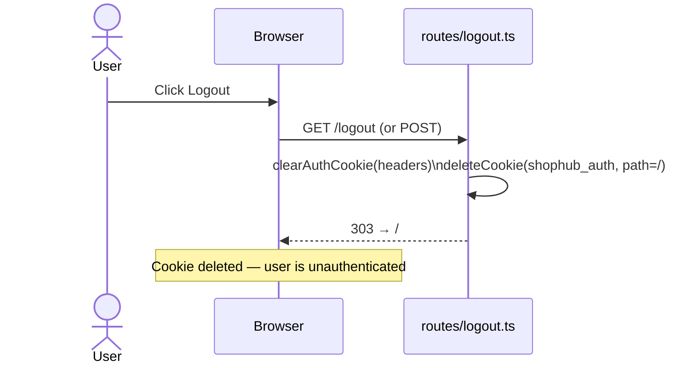

---

## 2. Product Browsing

### 2.1 Homepage Load

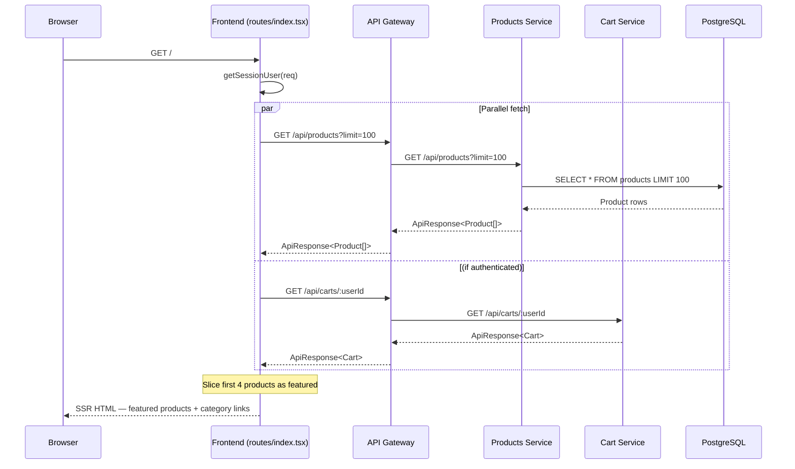

### 2.2 Product Listing Page (with Search and Filter)

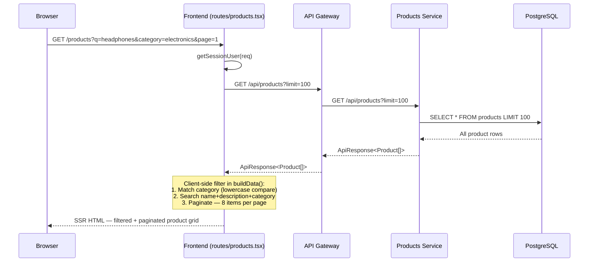

---

## 3. Cart Flows

### 3.1 Add Item to Cart

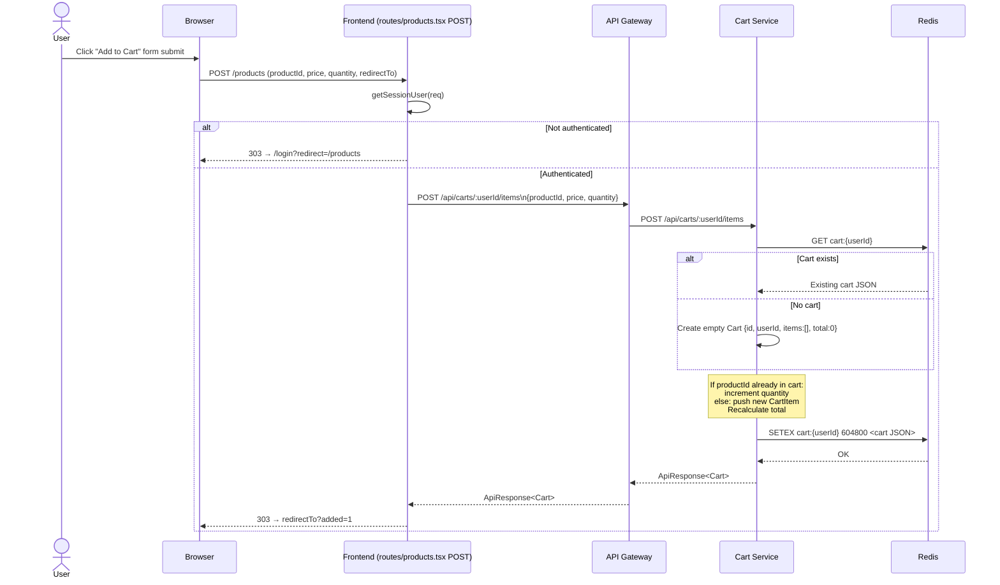

### 3.2 View Cart (with Product Enrichment)

The cart page uses the gateway's aggregation endpoint, fetching cart data and product details in a single network hop from the frontend.

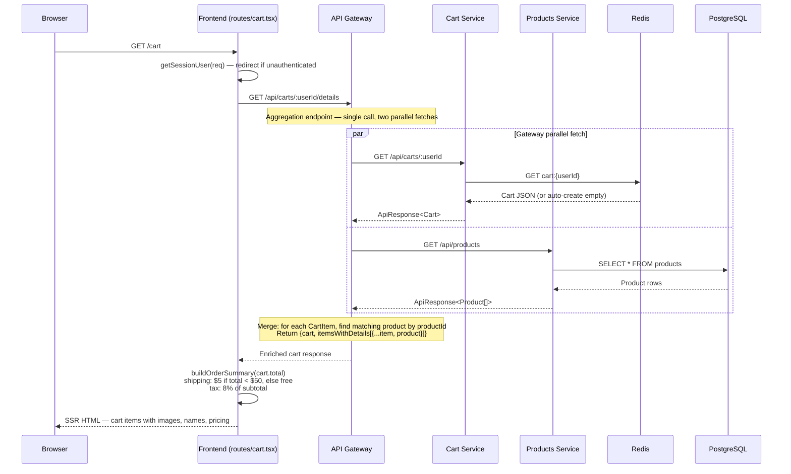

### 3.3 Update Item Quantity / Remove Item

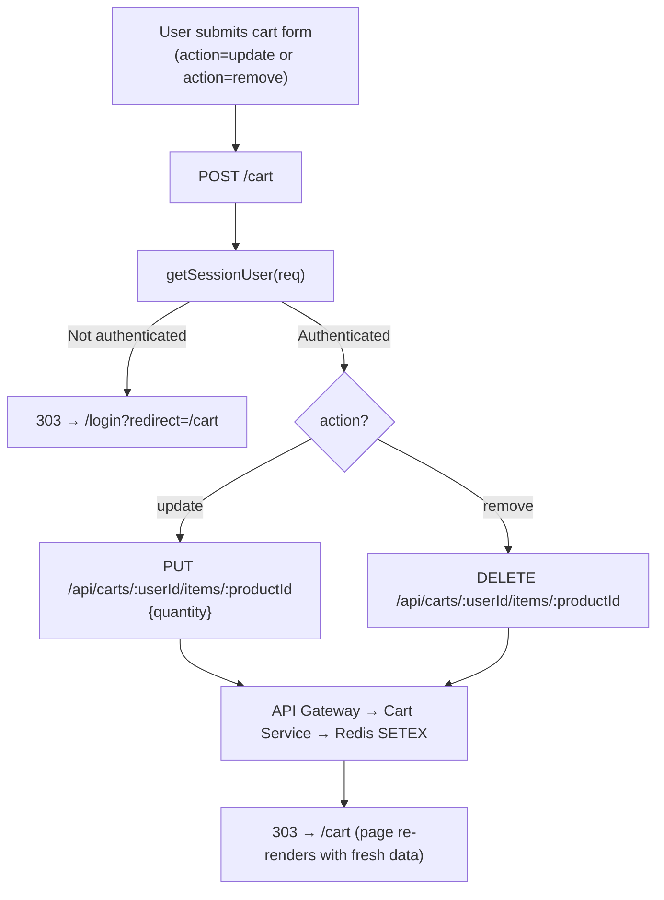

---

## 4. Checkout Flow

The checkout is the most complex flow, spanning frontend validation, order persistence, Redis event publishing, and cart cleanup.

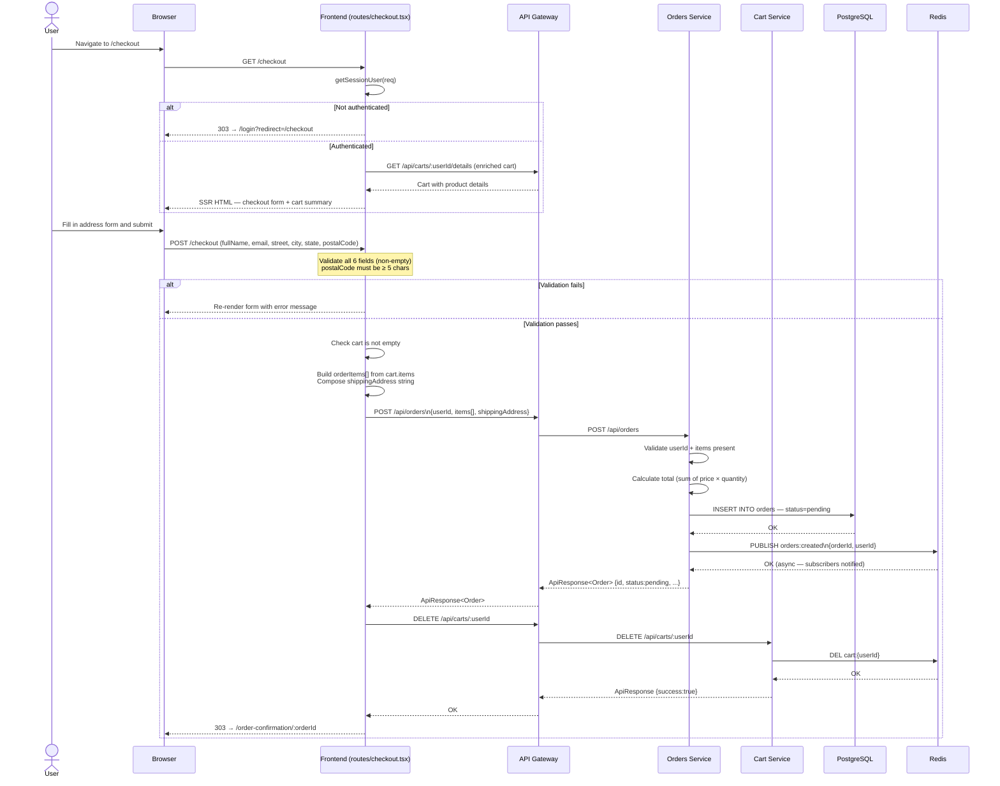

---

## 5. Order Confirmation Flow

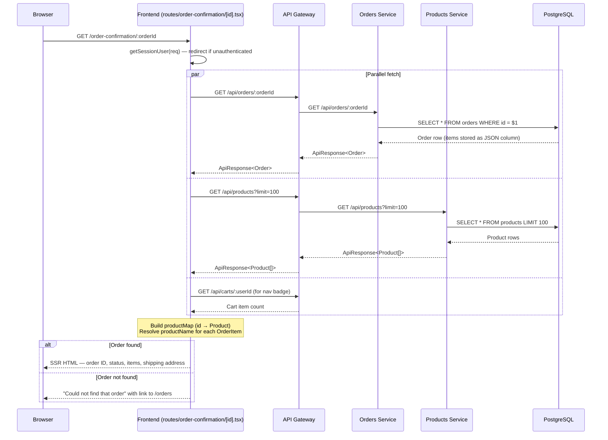

---

## 6. Order History Flow

```mermaid
sequenceDiagram
    participant Browser
    participant FE as Frontend (routes/orders.tsx)
    participant Gateway as API Gateway
    participant OS as Orders Service
    participant PS as Products Service
    participant PG as PostgreSQL

    Browser->>FE: GET /orders
    FE->>FE: getSessionUser(req) — redirect if unauthenticated

    par Parallel fetch
        FE->>Gateway: GET /api/orders?userId=:userId
        Gateway->>OS: GET /api/orders?userId=:userId
        OS->>PG: SELECT * FROM orders WHERE user_id = $1\nORDER BY created_at DESC LIMIT 20
        PG-->>OS: Order rows
        OS-->>Gateway: ApiResponse<Order[]>
        Gateway-->>FE: ApiResponse<Order[]>
    and
        FE->>Gateway: GET /api/products?limit=100
        Gateway->>PS: GET /api/products
        PS->>PG: SELECT * FROM products
        PG-->>PS: Rows
        PS-->>Gateway: Products[]
        Gateway-->>FE: Products[]
    and
        FE->>Gateway: GET /api/carts/:userId (for nav badge)
        Gateway-->>FE: Cart count
    end

    Note over FE: Build productMap; hydrate productName<br/>on each OrderItem where missing
    FE-->>Browser: SSR HTML — list of orders,\neach expandable with items and totals
```

---

## 7. Async Add-to-Cart (Island)

The products grid supports an async add-to-cart that avoids a full page navigation using a Fresh Island component.

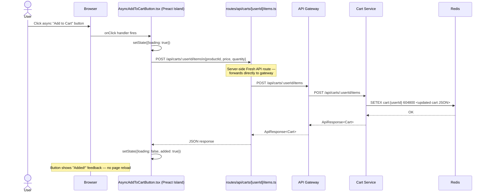

---

## 8. Health Check Flow

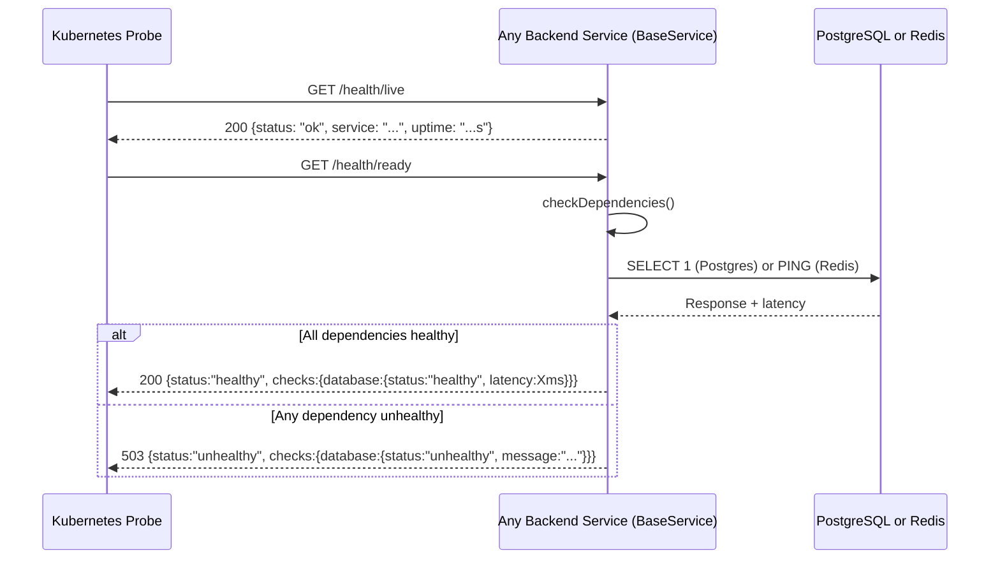

---

## 9. End-to-End Happy Path Summary

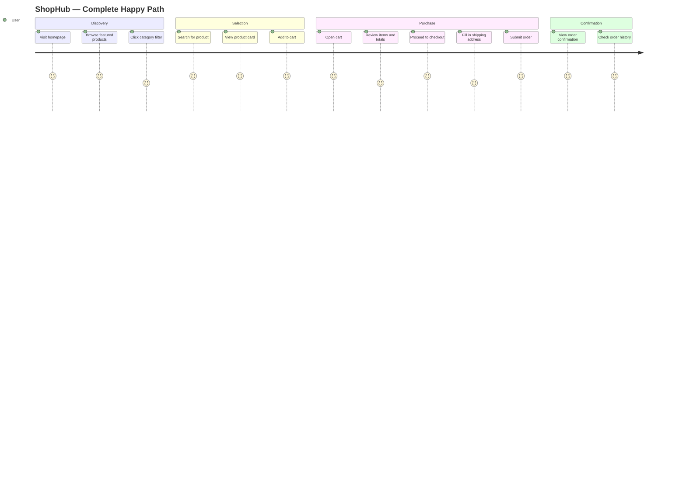

---

## 10. Error Handling Summary

| Scenario | Behaviour |
|---------|-----------|
| Unauthenticated access to `/cart`, `/checkout`, `/orders` | 303 redirect to `/login?redirect=<path>` |
| Invalid login credentials | Re-render login form with error message |
| Cart is empty at checkout | Re-render checkout form with "cart is empty" error |
| Incomplete/invalid checkout form | Re-render form highlighting the failing field |
| Add-to-cart failure (service error) | Re-render products page with error banner |
| Order not found at `/order-confirmation/:id` | Renders "Could not find that order" with a link to `/orders` |
| Backend service timeout (>5s) | `ServiceClient` returns `{success: false, error: "..."}` — no retry on AbortError |
| Backend service transient error (<3 attempts) | `ServiceClient` retries with exponential backoff (100ms, 200ms, 400ms) |
| Rate limit exceeded at gateway (>1000 req/min) | 429 Too Many Requests from rate limiter middleware |
