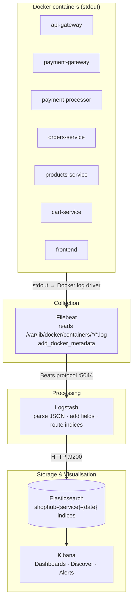

# ShopHub — Observability: Structured Logging & ELK Stack

## 1. Current State (Implemented)

### 1.1 Structured Logging — All Services

Every backend service that extends `BaseService` (`shared/base-service.ts`) automatically emits **one JSON line per HTTP request** to stdout. As of the observability implementation pass, the format is:

```json
{
  "timestamp": "2026-06-06T10:23:01.123Z",
  "service": "orders-service",
  "traceId": "a3f1c2d4-7e8b-4c2a-9f1d-b5e6a7c8d9e0",
  "level": "info",
  "method": "POST",
  "url": "/api/orders",
  "status": 201,
  "durationMs": 42
}
```

Key changes from the original format:
- `level` field added (`"info"` / `"warn"` / `"error"` derived from HTTP status)
- `durationMs` is now an integer (was the string `"42ms"`) — Logstash/Kibana can aggregate numeric values directly

The `X-Trace-Id` header is assigned at the API Gateway edge, propagated via `ServiceClient` to every downstream call, and echoed in every log line — so a single user action produces **correlated log lines across all services** queryable by `traceId`.

Errors are JSON with `level: "error"`:

```json
{
  "timestamp": "2026-06-06T10:23:01.500Z",
  "service": "payment-gateway",
  "traceId": "a3f1c2d4-...",
  "level": "error",
  "error": "Payment processor returned an error",
  "stack": "Error: ..."
}
```

### 1.2 Domain Events

In addition to HTTP span logs, key business outcomes emit dedicated event log lines:

| Service | Event | Fields |
|---------|-------|--------|
| `orders-service` | `order_created` | `orderId`, `userId`, `total`, `itemCount` |
| `payment-gateway` | `payment_charged` | `paymentId`, `orderId`, `userId`, `amount`, `currency`, `provider`, `providerTransactionId` |
| `payment-gateway` | `payment_declined` | `paymentId`, `orderId`, `userId`, `amount`, `provider`, `errorCode` |

### 1.3 Frontend Error Logs

`frontend/utils/shop.ts` and `frontend/routes/checkout.tsx` emit structured JSON to stdout rather than plain strings, so the Fresh container's logs are parseable by Filebeat.

---

## 2. ELK Stack Integration (Implemented)

---

## 3. ELK Stack Integration

### 3.1 Architecture



### 3.2 Docker Compose Overlay

The ELK stack lives in `docker-compose.elk.yml` — a compose overlay run alongside the main file:

```bash
docker-compose -f docker-compose.yml -f docker-compose.elk.yml up
```

Services included:

```yaml
elasticsearch:
  image: docker.elastic.co/elasticsearch/elasticsearch:8.12.0
  environment:
    - discovery.type=single-node
    - xpack.security.enabled=false
    - ES_JAVA_OPTS=-Xms512m -Xmx512m
  ports:
    - "9200:9200"
  volumes:
    - es_data:/usr/share/elasticsearch/data
  healthcheck:
    test: ["CMD-SHELL", "curl -s http://localhost:9200/_cluster/health | grep -q '\"status\":\"green\"\\|\"status\":\"yellow\"'"]
    interval: 30s
    timeout: 10s
    retries: 5
  networks:
    - microservices

kibana:
  image: docker.elastic.co/kibana/kibana:8.12.0
  ports:
    - "5601:5601"
  environment:
    ELASTICSEARCH_HOSTS: http://elasticsearch:9200
  depends_on:
    elasticsearch:
      condition: service_healthy
  networks:
    - microservices

logstash:
  image: docker.elastic.co/logstash/logstash:8.12.0
  volumes:
    - ./observability/logstash.conf:/usr/share/logstash/pipeline/logstash.conf:ro
  depends_on:
    elasticsearch:
      condition: service_healthy
  networks:
    - microservices

filebeat:
  image: docker.elastic.co/beats/filebeat:8.12.0
  user: root
  volumes:
    - ./observability/filebeat.yml:/usr/share/filebeat/filebeat.yml:ro
    - /var/lib/docker/containers:/var/lib/docker/containers:ro
    - /var/run/docker.sock:/var/run/docker.sock:ro
  depends_on:
    - logstash
  networks:
    - microservices

# Add to volumes section:
# es_data:
```

### 3.3 Filebeat Configuration (`observability/filebeat.yml`)

```yaml
filebeat.inputs:
  - type: container
    paths:
      - /var/lib/docker/containers/*/*.log
    processors:
      - add_docker_metadata:
          host: "unix:///var/run/docker.sock"

processors:
  - drop_fields:
      fields: ["agent", "ecs", "host", "input"]
      ignore_missing: true

output.logstash:
  hosts: ["logstash:5044"]
```

### 3.4 Logstash Pipeline (`observability/logstash.conf`)

```
input {
  beats {
    port => 5044
  }
}

filter {
  # Parse the JSON that all backend services already emit
  if [message] =~ /^\{/ {
    json {
      source  => "message"
      target  => "log"
    }

    # Promote key fields to the top level for easy querying
    mutate {
      rename => {
        "[log][service]"   => "service"
        "[log][traceId]"   => "traceId"
        "[log][level]"     => "level"
        "[log][method]"    => "http_method"
        "[log][url]"       => "http_url"
        "[log][status]"    => "http_status"
        "[log][duration]"  => "duration_raw"
        "[log][event]"     => "event"
        "[log][userId]"    => "userId"
        "[log][orderId]"   => "orderId"
      }
    }

    # Convert duration "42ms" → integer 42 for numeric aggregations
    if [duration_raw] {
      grok { match => { "duration_raw" => "%{NUMBER:duration_ms:int}ms" } }
    }
  }

  # Tag plain-text frontend errors
  if [message] =~ /^\[shopApi/ or [message] =~ /^\[Checkout/ {
    mutate { add_field => { "service" => "frontend" "level" => "error" } }
  }

  # Infer level from HTTP status when not set
  if ![level] and [http_status] {
    if [http_status] >= 500 {
      mutate { add_field => { "level" => "error" } }
    } else if [http_status] >= 400 {
      mutate { add_field => { "level" => "warn" } }
    } else {
      mutate { add_field => { "level" => "info" } }
    }
  }

  mutate {
    add_field => { "environment" => "development" }
    remove_field => ["message", "log", "duration_raw"]
  }
}

output {
  elasticsearch {
    hosts    => ["elasticsearch:9200"]
    index    => "shophub-%{[service]}-%{+YYYY.MM.dd}"
    # Fallback index for unrecognised containers
    if ![service] {
      index  => "shophub-unknown-%{+YYYY.MM.dd}"
    }
  }
}
```

### 3.5 Kibana Dashboards to Build

Once data is flowing, the following dashboards are immediately buildable from the existing log schema:

| Dashboard | Key visualisations |
|-----------|--------------------|
| **Request Traffic** | Requests/min per service, HTTP status breakdown, top URLs |
| **Latency** | P50/P95/P99 `duration_ms` per service and endpoint |
| **Error Rate** | `level: error` count over time, grouped by service |
| **Trace Explorer** | Search by `traceId` to see every hop for a single user request |
| **Payment Funnel** | `event: order_created` → `payment_charged` → `payment_declined` counts |
| **Slow Requests** | Top 10 slowest endpoints by `duration_ms` |

### 3.6 Startup Sequence

```bash
# Start the application stack only
deno task start

# Start full stack including ELK overlay
docker-compose -f docker-compose.yml -f docker-compose.elk.yml up --build

# Open Kibana (wait ~60s for Elasticsearch to be ready)
open http://localhost:5601

# In Kibana → Stack Management → Data Views → create: shophub-*
# Then: Discover → filter by service, traceId, level
```

---

## 4. Ports Reference (full stack)

| Service | Port | Purpose |
|---------|------|---------|
| Frontend | 8000 | SSR web app |
| API Gateway | 3000 | Single ingress point |
| Payment Gateway | 3001 | Payment facade |
| Payment Processor | 3002 | Mock processor |
| Products Service | 3003 | Product catalog |
| Orders Service | 3004 | Order management |
| Cart Service | 3005 | Shopping cart |
| Analytics Service | 3006 | Click analytics ingestion |
| PostgreSQL | 5432 | Relational storage |
| Redis | 6379 | Cache + pub/sub |
| Elasticsearch | 9200 | Log storage |
| Kibana | 5601 | Log visualisation |
| Logstash | 12201/udp | GELF log ingestion from Docker |
| OTel Collector | 4317 | OTLP gRPC receiver |
| OTel Collector | 4318 | OTLP HTTP receiver (used by services) |
| OTel Collector | 8888 | Collector self-metrics (Prometheus) |
| Jaeger | 16686 | Distributed trace UI |
| Plausible | 8001 | Product analytics UI |

See [OTEL.md](OTEL.md) for a full description of the distributed tracing pipeline.
