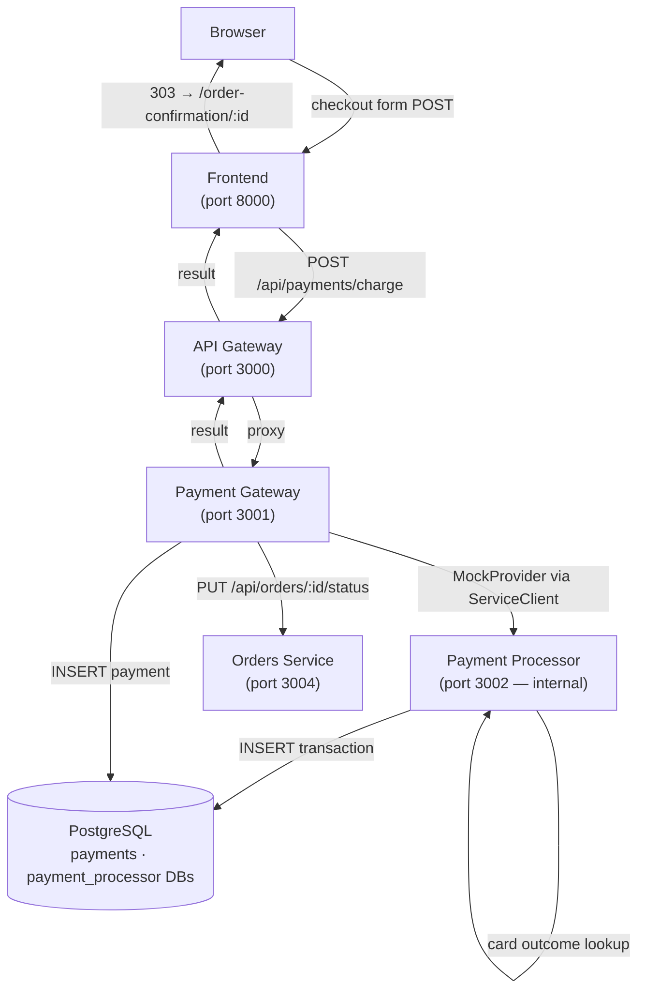
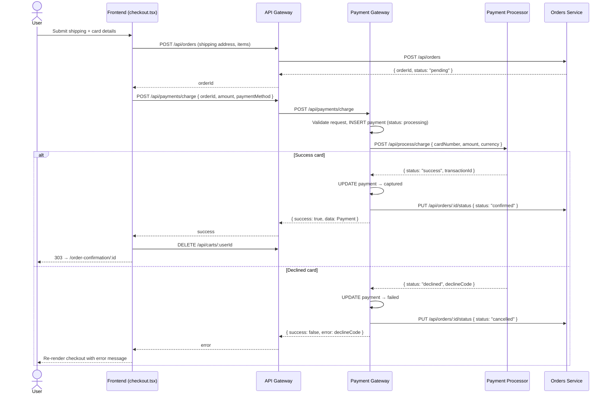
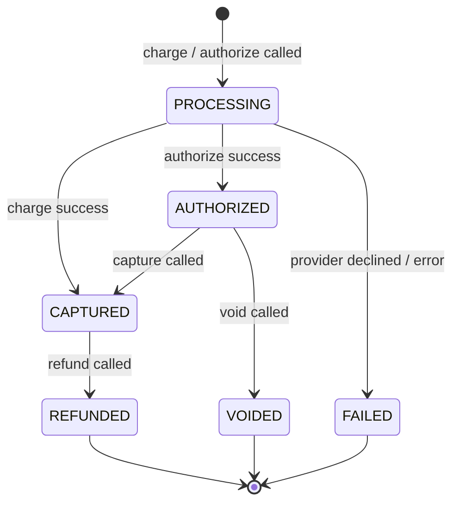
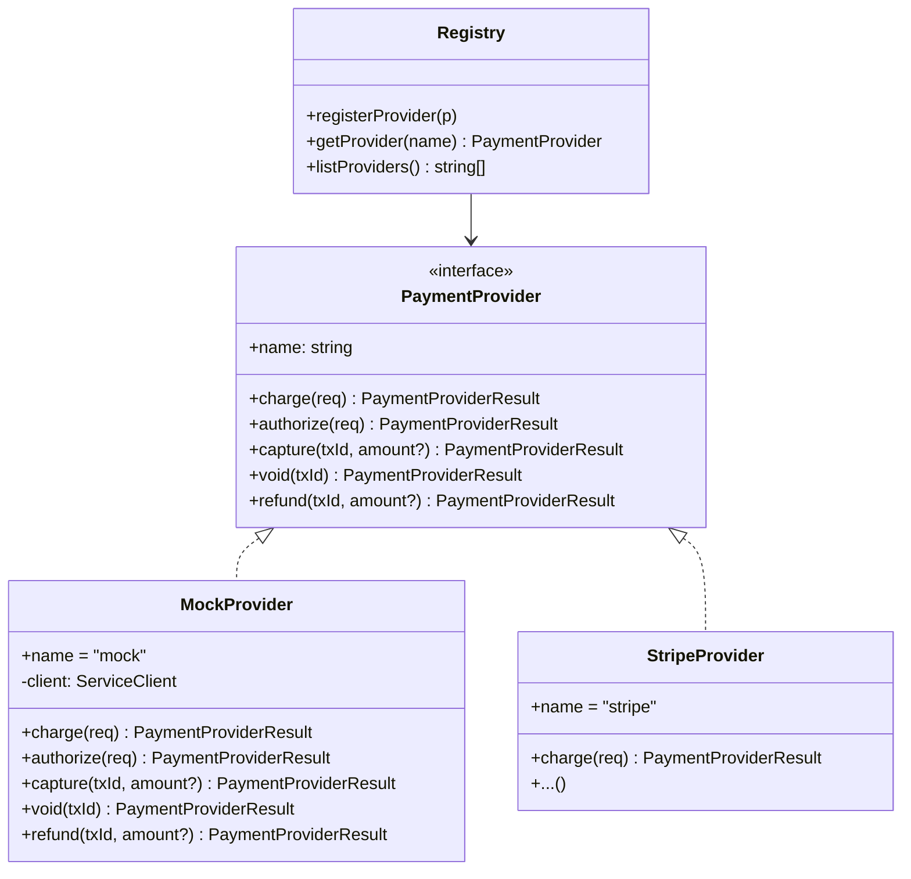

# ShopHub — Payment Services

## 1. Overview

Two new microservices close the gap in the checkout flow: previously, orders were created with status `pending` but no actual charge was made. The payment layer adds a **pluggable gateway facade** and a **deterministic mock processor**, wired end-to-end through the checkout page.

Both services follow every existing convention: Deno 1.40, Oak v12.6.1, `BaseService`, `ServiceClient`, multi-stage Dockerfile, structured JSON logging, PostgreSQL via `deno-postgres@v0.17.0`, Redis via `deno-redis@v0.32.3`.



---

## 2. End-to-End Checkout Flow



---

## 3. Payment Gateway Service (`services/payment-gateway/`)

| Attribute | Value |
|-----------|-------|
| Runtime | Deno + Oak v12.6.1 |
| Port | 3001 |
| Database | PostgreSQL 15 — `payments` database |
| Active provider | `PAYMENT_PROVIDER` env var (default `"mock"`) |

### 3.1 API Surface

| Method | Path | Description |
|--------|------|-------------|
| `POST` | `/api/payments/charge` | Single-step charge — authorise and capture in one call |
| `POST` | `/api/payments/authorize` | Reserve funds without capturing |
| `POST` | `/api/payments/:id/capture` | Capture a previously authorised payment |
| `POST` | `/api/payments/:id/void` | Void an authorised (not yet captured) payment |
| `POST` | `/api/payments/:id/refund` | Refund a captured payment |
| `GET`  | `/api/payments/:id` | Get payment by ID |
| `GET`  | `/api/payments` | List payments (`?orderId=` `?userId=` `?status=`) |
| `GET`  | `/api/payments/providers` | List registered provider names |
| `GET`  | `/health`, `/health/live`, `/health/ready` | Inherited from `BaseService` |

### 3.2 Payment Status Lifecycle



### 3.3 Request / Response Shapes

**Charge request:**
```json
{
  "orderId": "750e8400-...",
  "userId": "550e8400-...",
  "amount": 92.78,
  "currency": "USD",
  "paymentMethod": {
    "cardNumber": "4242424242424242",
    "cardExpiry": "12/26",
    "cardCvv": "123",
    "cardHolder": "Jane Smith"
  }
}
```

**Payment response:**
```json
{
  "success": true,
  "data": {
    "id": "c3f1e2d4-...",
    "orderId": "750e8400-...",
    "userId": "550e8400-...",
    "amount": 92.78,
    "currency": "USD",
    "status": "captured",
    "provider": "mock",
    "providerTransactionId": "a1b2c3d4-...",
    "createdAt": "2026-06-06T10:23:01.000Z",
    "updatedAt": "2026-06-06T10:23:01.123Z"
  },
  "timestamp": "2026-06-06T10:23:01.200Z",
  "traceId": "..."
}
```

### 3.4 Order Status Side-Effects

After every charge / capture / void / refund, the gateway calls `Orders Service PUT /api/orders/:id/status`:

| Payment outcome | Order status set to |
|----------------|---------------------|
| Charge / capture success | `confirmed` |
| Charge failure / void | `cancelled` |
| Refund | (no change — order stays `confirmed`) |

This call is best-effort: if it fails the payment response is still returned to the caller; the error is logged with the shared `traceId`.

---

## 4. Payment Processor Service (`services/payment-processor/`)

| Attribute | Value |
|-----------|-------|
| Runtime | Deno + Oak v12.6.1 |
| Port | 3002 |
| Visibility | Internal only — not proxied through the API Gateway |
| Database | PostgreSQL 15 — `payment_processor` database |

### 4.1 API Surface

| Method | Path | Description |
|--------|------|-------------|
| `POST` | `/api/process/charge` | Process a single-step charge |
| `POST` | `/api/process/authorize` | Authorise hold on card |
| `POST` | `/api/process/:id/capture` | Capture authorised transaction |
| `POST` | `/api/process/:id/void` | Void authorised transaction |
| `POST` | `/api/process/:id/refund` | Refund captured transaction |
| `GET`  | `/api/transactions/:id` | Look up transaction by ID |
| `GET`  | `/health`, `/health/live`, `/health/ready` | Inherited from `BaseService` |

### 4.2 Test Card Behaviour

The processor looks up the full card number in a deterministic table (`services/payment-processor/cards.ts`). Any card not in the table defaults to success.

| Card Number | Brand | Outcome | Decline Code |
|-------------|-------|---------|--------------|
| `4111111111111111` | Visa | Success | — |
| `4242424242424242` | Visa | Success | — |
| `5555555555554444` | Mastercard | Success | — |
| `4000000000000002` | Visa | Declined | `card_declined` |
| `4000000000009995` | Visa | Declined | `insufficient_funds` |
| `4000000000000119` | Visa | Error | `processing_error` |
| Any other number | Visa | Success | — |

---

## 5. Provider Plugin Architecture

The gateway holds a registry of `PaymentProvider` implementations. Swapping providers at runtime requires only changing the `PAYMENT_PROVIDER` environment variable; adding a new provider requires one new file and one `registerProvider()` call.



**Adding a new provider (e.g. Stripe):**

1. Create `services/payment-gateway/providers/stripe.ts` implementing `PaymentProvider`
2. In `services/payment-gateway/main.ts`, add:
   ```typescript
   registerProvider(new StripeProvider(Deno.env.get("STRIPE_SECRET_KEY")!));
   ```
3. Set `PAYMENT_PROVIDER=stripe` in the service's environment

No changes to existing code required.

---

## 6. Database Schema

### `payments` database (Payment Gateway)

```sql
CREATE TABLE payments (
  id                     UUID PRIMARY KEY,
  order_id               VARCHAR(255) NOT NULL,
  user_id                VARCHAR(255) NOT NULL,
  amount                 DECIMAL(10, 2) NOT NULL,
  currency               VARCHAR(3) NOT NULL DEFAULT 'USD',
  status                 VARCHAR(20) NOT NULL DEFAULT 'pending',
  provider               VARCHAR(50) NOT NULL,
  provider_transaction_id VARCHAR(255),
  failure_reason         TEXT,
  metadata               JSONB,
  created_at             TIMESTAMP NOT NULL,
  updated_at             TIMESTAMP NOT NULL
);
```

### `payment_processor` database (Mock Processor)

```sql
CREATE TABLE transactions (
  id                    UUID PRIMARY KEY,
  type                  VARCHAR(20) NOT NULL,   -- charge | authorize | capture | void | refund
  amount                DECIMAL(10, 2) NOT NULL,
  currency              VARCHAR(3) NOT NULL DEFAULT 'USD',
  status                VARCHAR(20) NOT NULL,   -- success | declined | error
  card_last4            VARCHAR(4),
  card_brand            VARCHAR(50),
  decline_code          VARCHAR(100),
  parent_transaction_id UUID,
  created_at            TIMESTAMP NOT NULL
);
```

---

## 7. Infrastructure

### Docker Compose

```
payment-processor   port 3002   DB_NAME=payment_processor   depends: postgres
payment-gateway     port 3001   DB_NAME=payments            depends: postgres · redis · payment-processor · orders-service
api-gateway         port 3000   +PAYMENT_GATEWAY_SERVICE_URL depends: +payment-gateway
```

### Environment Variables

| Variable | Service | Default | Purpose |
|----------|---------|---------|---------|
| `PAYMENT_PROVIDER` | payment-gateway | `mock` | Active provider name |
| `PAYMENT_PROCESSOR_URL` | payment-gateway | `http://localhost:3002` | Mock processor base URL |
| `ORDERS_SERVICE_URL` | payment-gateway | `http://localhost:3004` | For order status updates |
| `PAYMENT_GATEWAY_SERVICE_URL` | api-gateway | `http://localhost:3001` | Gateway proxy target |

---

## 8. Files Changed

| File | Change |
|------|--------|
| `services/payment-processor/main.ts` | New service |
| `services/payment-processor/cards.ts` | Test-card table |
| `services/payment-processor/Dockerfile` | Multi-stage build |
| `services/payment-gateway/main.ts` | New service |
| `services/payment-gateway/providers/mod.ts` | Provider interface + registry |
| `services/payment-gateway/providers/mock.ts` | MockProvider implementation |
| `services/payment-gateway/Dockerfile` | Multi-stage build |
| `shared/types/mod.ts` | Added `PaymentStatus`, `Payment`, `PaymentMethod`, `ChargeRequest`, `ProcessorTransaction` |
| `database/init.sql` | Added `payment_processor` and `payments` database schemas |
| `docker-compose.yml` | Added both new services; API Gateway env + depends_on updated |
| `services/api-gateway/main.ts` | Added `paymentGatewayService` client + `/api/payments/:path*` proxy |
| `deno.json` | Added `logs:payment-gateway` and `logs:payment-processor` tasks |
| `frontend/utils/shop.ts` | Added `Payment` interface |
| `frontend/routes/checkout.tsx` | Added card form fields, card validation, payment API call |
